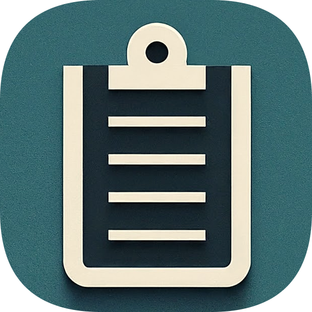

<!-- PROJECT LOGO -->
 

  

  <h3 align="center">Url2Clipboard</h3>

  

    Copy current tab URL to clipboard as Markdown
     
    <a href="https://github.com/wzktravel/url2clipboard/issues">Report Bug</a>
    ·
    <a href="https://github.com/wzktravel/url2clipboard/issues">Request Feature</a>
  

### Built With
* [Plasmo](https://docs.plasmo.com/)
* [shadcn/ui](https://ui.shadcn.com/)
* [Tailwind CSS](https://tailwindcss.com/)

